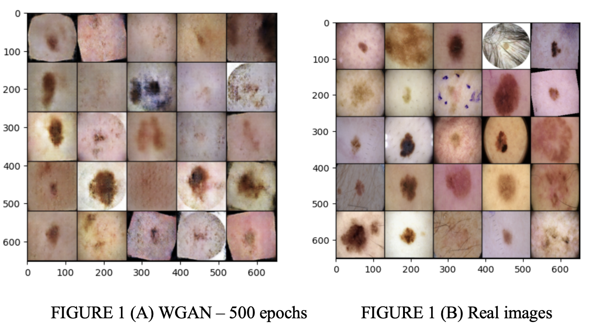

# MelanoGAN
Melanoma, a form of skin cancer, arises from the malignant transformation of melanocytes, the cells responsible for producing the pigment melanin. Drawing from our previous research endeavors [1-6], this study embarks on a novel approach to enhance the classification of melanoma skin cancer images. We research the use of Wasserstein Generative Adversarial Networks (WGANs) to enhance diagnostic and research capabilities.

<h2> What are WGANS? </h2>

 A Wasserstein Generative Adversarial Network (WGAN) is an advanced type of Generative Adversarial Network (GAN) designed to improve the stability and effectiveness of training GANs. Traditional GANs often suffer from issues like mode collapse, vanishing gradients, and unstable training dynamics, which make them challenging to train. WGAN addresses these issues by using the Earth Mover's (EM) distance, also known as the Wasserstein distance, as the loss function instead of the Jensen-Shannon divergence used in standard GANs. 

<h2> Results </h2>
The results obtained were almost indistinguishable to the eye. The WGAN learned how to represent the malignant images accurately and are depicted in the images below. Looking at the learning process shows how the generator learned to capture the essence of the malignant images. The project was conducted under significant data constraints, utilizing only around 500 images to train the GAN while operating with limited GPU resources.
 
 

References:
1.	Ayushi Kumar, Ari Kapelyan, and Avimanyou Vatsa (2021). Classification of Skin Phenotype: Melanoma Skin Cancer. IEEE Integrated STEM Education Conference (ISEC 2021), Princeton, NJ, USA, DOI: 10.1109/ISEC52395.2021.9763999. 
2.	Ayushi Kumar and Avimanyou Vatsa (2022), Untangling Classification Methods for Melanoma Skin Cancer, Frontiers in Big Data, Data Mining, and Management, DOI: 10.3389/fdata.2022.848614. 
3.	Ayushi Kumar and Avimanyou Vatsa, “Influence of GFP GAN on Melanoma Classification,” IEEE Integrated STEM Education Conference (ISEC 2022), Princeton, NJ, USA, DOI: 10.1109/ISEC54952.2022.10025075. 
4.	Q’Andre Small, Avimanyou Vatsa, Tyler Jan, Ava Miller, and Ayushi Kumar, “Unsupervised GAN for Melanoma,” IEEE Integrated STEM Education Conference (ISEC 2022), Princeton, NJ, USA, DOI: 10.1109/ISEC54952.2022.10025272. 
5.	Ava Miller, Tyler Jan, Q’Andre Small, Ayushi Kumar, and Avimanyou Vatsa, “GAN Assistance in Diagnosis of Melanoma,” IEEE Integrated STEM Education Conference (ISEC 2022), Princeton, NJ, USA, DOI: 10.1109/ISEC54952.2022.10025328. 
6.	Tyler Jan, Ava Miller, Q’Andre Small, Ayushi Kumar, Avimanyou Vatsa, “Effect of Cycle GAN in Melanoma Classification,” Integrated STEM Education Conference (ISEC 2022), Princeton, NJ, USA, DOI: 10.1109/ISEC54952.2022.10025273.

