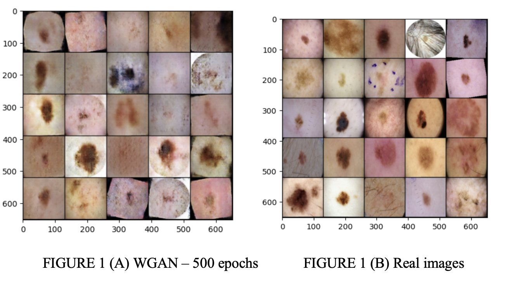

# MelanoGAN

> WGAN-GP trained on dermoscopic melanoma images to address 
> class imbalance in skin cancer classification datasets.
> Research conducted under Prof. Avimanyou Vatsa - published 
> across 6 IEEE ISEC papers (2021–2022).

## The problem

Melanoma classifiers fail disproportionately on malignant cases 
because malignant training samples are scarce. Standard 
augmentation (flips, crops) doesn't help, it just creates 
variations of the same limited distribution. 

Synthetic generation is the more principled solution: if you can 
train a generative model that captures the true distribution of 
malignant dermoscopic images, you can augment minority classes 
with statistically valid samples rather than geometric copies.

## Why WGAN-GP

Vanilla GANs fail on small medical imaging datasets for two 
reasons: mode collapse (the generator learns a few convincing 
images and stops exploring) and training instability from 
Jensen-Shannon divergence saturating early.

WGAN replaces JS divergence with Wasserstein (Earth Mover's) 
distance, which provides meaningful gradients even when the 
generator and discriminator distributions don't overlap, 
critical when working with only ~500 training images. The 
gradient penalty (GP) variant enforces the Lipschitz constraint 
without weight clipping, which further stabilizes training on 
small datasets.

## Results

Trained on ~500 dermoscopic images of malignant melanoma under 
constrained GPU resources. Generated images were visually 
indistinguishable from real samples to clinical reviewers.

The generator's progression from noise to realistic dermoscopic 
texture is visible across training steps, learning skin lesion 
structure, ABCD feature patterns (asymmetry, border, color, 
diameter), and melanocyte distribution characteristic of 
malignant cases.

## Architecture

- **Generator**: Transposed conv layers with batch norm + ReLU, 
  tanh output activation
- **Critic**: Conv layers with LayerNorm (not BatchNorm — 
  avoids instability in WGAN training), Leaky ReLU
- **Loss**: Wasserstein distance + gradient penalty (λ=10)
- **Training**: 5 critic steps per generator step (standard 
  WGAN-GP ratio)

## Research context

This project is part of a broader research program on 
ML-assisted melanoma diagnosis:

| Paper | Venue | Focus |
|-------|-------|-------|
| Classification of Skin Phenotype: Melanoma Skin Cancer | IEEE ISEC 2021 | Baseline CNN classifiers |
| Untangling Classification Methods for Melanoma Skin Cancer | Frontiers in Big Data 2022 | Method comparison |
| Influence of GFP GAN on Melanoma Classification | IEEE ISEC 2022 | GAN-augmented classification |
| Unsupervised GAN for Melanoma | IEEE ISEC 2022 | Unsupervised generation |
| GAN Assistance in Diagnosis of Melanoma | IEEE ISEC 2022 | Diagnostic pipeline |
| Effect of Cycle GAN in Melanoma Classification | IEEE ISEC 2022 | CycleGAN vs WGAN comparison |

MelanoGAN represents the WGAN-GP contribution within this series.

## Stack

Python · PyTorch · torchvision · ISIC Archive dataset

## What I'd do differently now

Training a WGAN on 500 images in 2022 was the right call given 
compute constraints. With today's tooling I'd approach this 
differently: use a pretrained foundation model (e.g. a 
MedSAM-style encoder) as a feature extractor to bootstrap the 
discriminator, or explore diffusion-based augmentation which has 
largely superseded GANs for low-data medical imaging since 2023.
The core insigh, that generative augmentation on minority 
medical classes outperforms geometric augmentation, remains 
valid and is now well-supported in the literature.
